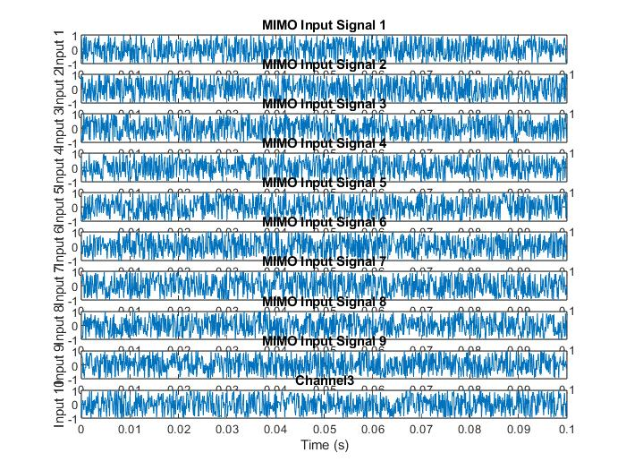
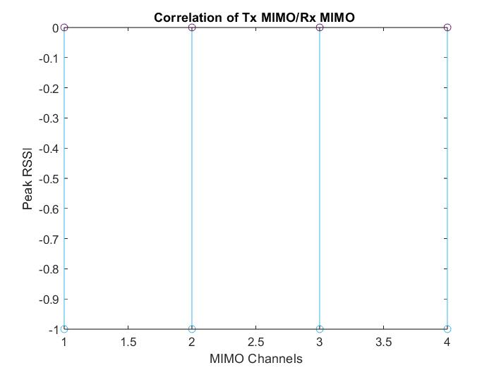
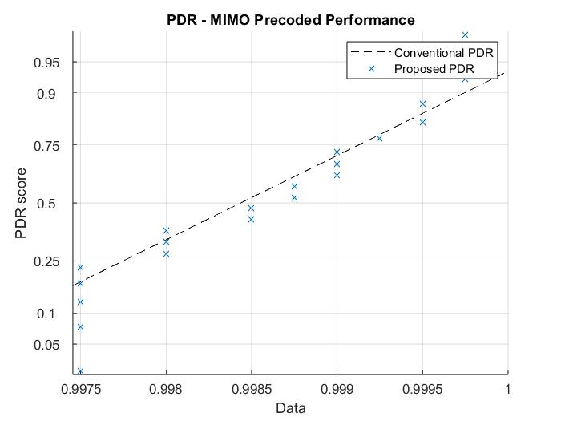
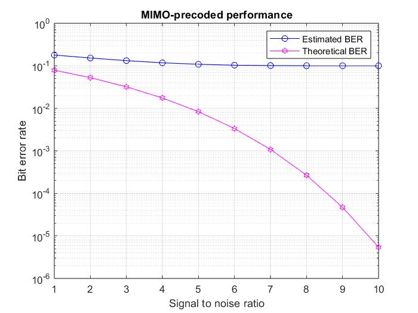
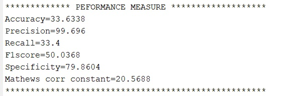

# Efficient Spectrum Utilization for Massive MIMO System Using Artificial Intelligence

Efficient Spectrum Utilization for Massive MIMO System Using Artificial Intelligence is a MATLAB simulation framework for advanced MIMO (Multiple-Input Multiple-Output) wireless communication leveraging neural network-based precoding, realistic channel/noise modeling, and comprehensive performance analysis.

---

## Table of Contents

- [Overview](#overview)
- [Features](#features)
- [Project Structure](#project-structure)
- [Visual Results](#visual-results)
- [Requirements](#requirements)
- [Installation & Usage](#installation--usage)
- [Customization](#customization)
- [Evaluation Metrics](#evaluation-metrics)
- [License](#license)

---

## Overview

This project models a MIMO communication system using neural networks for both precoding and detection. It supports full signal generation, transmission simulation with real-world disturbances, and AI-based evaluation, making it suitable for wireless communications research and education.

---

## Features

- Generation of random input signals for multichannel MIMO.
- Neural precoding using Self-Organizing Map architecture.
- Realistic channel simulation with noise and mixing.
- Neural decoding and classification of received signals.
- Plots and quantitative output for:
  - Bit Error Rate (BER)
  - Packet Delivery Ratio (PDR)
  - Accuracy, Precision, Recall, F1 score, Specificity, Matthews Corr. Coefficient
- Results visualized and saved for documentation.

---

## Project Structure

| File                          | Purpose                                               |
|------------------------------|------------------------------------------------------|
| Main_MIMO_Pre_InpGen.m       | Main simulation pipeline                              |
| mimoInputGenerator.m         | Generates random MIMO input signals                   |
| tx_precoder.m                | Neural network-based precoding (SOM)                  |
| rx_precoded_data_analyser.m  | Simulates channel effects and decodes signal          |
| Deep_conjugate_neural_computing.m | Neural classification/detection                    |
| Linear_Analysis2.m           | (Alternative) Network/classification analysis          |
| plts.m                      | BER calculation and plotting                           |
| perfmea.m, perf_eval.m       | PDR and throughput measurement                         |
| performance_measure_routine.m| Aggregates AI performance metrics                      |
| images/                     | Results images and visualizations                       |

---

## Visual Results

*Randomly generated MIMO input signals for multiple channels showing signal variation over time.*

*Correlation plot between transmitted and received MIMO channels, highlighting channel relationship.*

*Packet Delivery Ratio (PDR) performance comparison of conventional and proposed MIMO precoding techniques.*

*Bit Error Rate (BER) curve showing estimated versus theoretical BER over varying signal-to-noise ratios.*

*Performance metrics output including accuracy, precision, recall, F1-score, specificity, and Matthews correlation coefficient.*

# Requirements

This project requires the following software and MATLAB toolboxes to function correctly:

- MATLAB R2018a or later version
- Statistics and Machine Learning Toolbox
- Neural Network Toolbox

Please ensure you have these installed to avoid compatibility issues when running the simulation.

# Installation & Usage

Follow these steps to set up and run the simulation:

1. **Clone the repository to your local machine:**

- git clone https://github.com/your-username/your-repository.git
- cd your-repository

2. **Open MATLAB** and add the project folder (including the `images/` folder if present) to the MATLAB path.

3. **Run the main MATLAB script:**

- Open `Main_MIMO_Pre_InpGen.m` in MATLAB.
- Execute the script.
- Input the requested sampling frequency when prompted.

4. **Observe the outputs:**

- Various plots will be generated displaying input signals, channel correlation, BER, PDR, and classification results.
- These images will also be saved inside the `images/` folder for your reference.

# Customization

You can customize the simulation parameters and neural network configurations as follows:

- **Input signals:** Change the number of channels, number of samples, and sampling rate in `mimoInputGenerator.m`.

- **Neural Network settings:** Modify the architecture, layer size, or training strategy in `Deep_conjugate_neural_computing.m` and `Linear_Analysis2.m`.

- **Channel and noise:** Modify the noise level, mixing parameters, and channel effects in `rx_precoded_data_analyser.m` and `tx_precoder.m`.

- **Plotting and evaluation:** Customize evaluation metrics or plotting parameters in `plts.m`, `perfmea.m`, and `perf_eval.m`.

# Evaluation Metrics

This project provides a comprehensive evaluation of the MIMO system’s performance through:

- **Bit Error Rate (BER):** Probability of bit transmission errors under varying signal-to-noise conditions.

- **Packet Delivery Ratio (PDR):** Measurement of successful packet transmissions over the noisy channel.

- **Classification Metrics:** Evaluation of the neural network performance including accuracy, precision, recall, F1-score, specificity, and Matthews correlation coefficient (MCC), assessing the detection quality.

These metrics combine communication theory and machine learning to give a robust picture of system effectiveness.

# License

This project is made available under the **MIT License**, which permits wide use, modification, and distribution under simple terms. See the `LICENSE` file in the repository for details.

